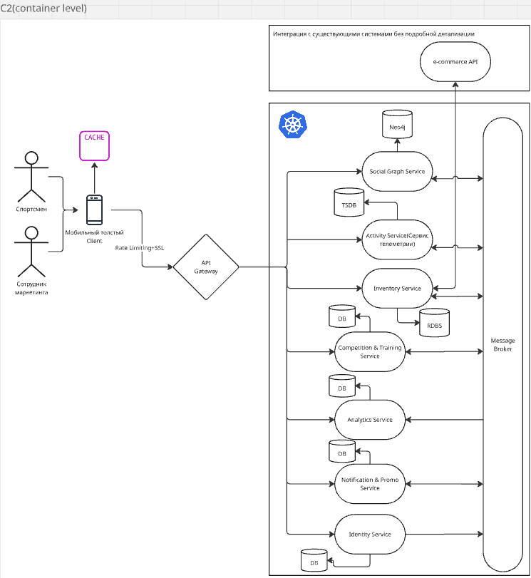

# Концептуальная архитектура

1. Мобильное приложение(Толстый клиент)
Реализует логику кэширования данных (Local Database) для поддержки офлайн-режима.  
2. ​API Gateway: 
- Единая точка входа.
- Отвечает за маршрутизацию, SSL-терминацию и Rate Limiting.
- Не должен быть слишком "умным"
3. ​Identity Service: 
- Аутентификация (OAuth2/OIDC), управление профилем, 
- Согласие на обработку данных (Privacy).
4. ​Social Graph Service: 
- Управление связями (друзья, группы). 
- Использует графовую базу данных (Neo4j) для быстрого поиска «людей с теми же маршрутами», а также для того чтобы выстраивать отношения между пользователем и пользователем, между группой и пользователем
5. Activity Service(Сервис телеметрии): 
- Прием и обработка потоков данных с устройств.
- Использует Базу данных временных рядов.
6. Inventory Service: 
- Интегрируется с существующим e-commerce API. 
- Анализирует износ инвентаря и предлагает товары.
7. Training & ​Competition Service: 
- Отдельный сервис для управления лидербордами и событиями в реальном времени. 
- Отслеживание и учет прогресса пользователя в тренировках.
- Создание, планирование(календарик) тренировочных программ. 
8. Analytics Service: 
- Сборка, обработка и анализ данных о тренировках и активностях пользователей.
- Создает отчеты, статистику и рекомендации для пользователей и администраторов.
9. Notification & Promo Service
- Управляет направлением уведомлений
- Публикация промо-акций
- Генерация уведомлений на основе ключевых событий от связанных сервисов

